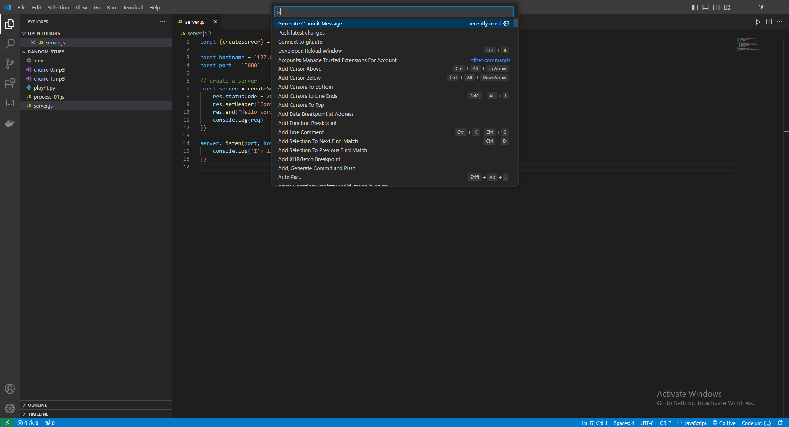
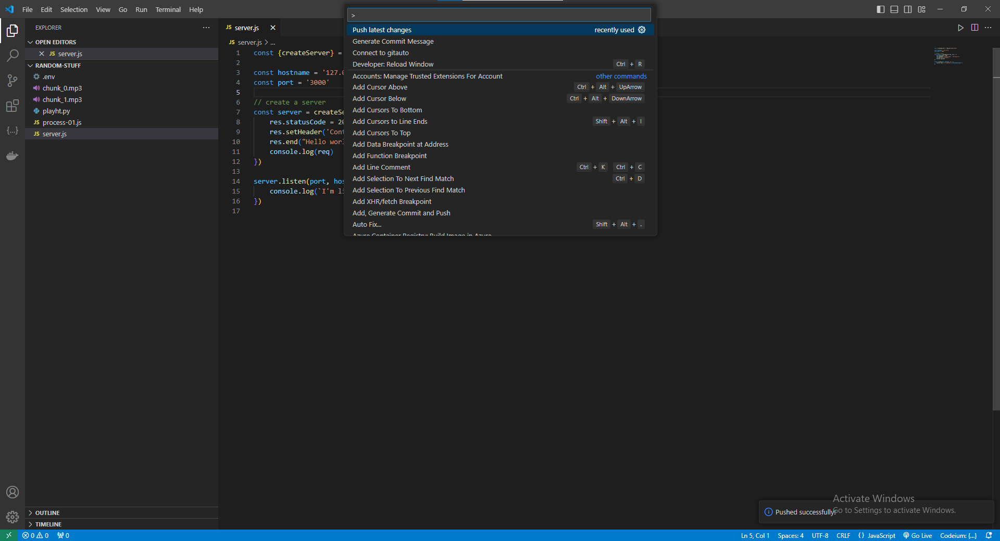

# gitauto

Optimize your git workflows. Create intuitive logical and scoped commit of you working branches. https://gitauto.davidconteh.engineer

## Features

  ### generate commit
  The generate commit messsge command generates a commit message which you can copy. It generates a  commit message, add the modified files and commit the changes. It does all of this on file by file basis.
  So if their are five modified changes. It loops over each of them one by one add them individual (git add) and generates a commit message for each (git commit). So if you have work for a long time on you codebase with hundreds of changes leave it to gitauto to work out commiting for you.

  ### git push
  The push latest changes command push the latest commited changes.
  

## Requirements

Make sure to setup your repository.

## Extension Settings

This is just an MVP - so no settings yet.

## Release Notes

Users appreciate release notes as you update your extension.

### 1.0.0

Initial release of gitauto
- git add
- git commit
- git push

### 1.0.1
  - handle uri to login from the website

## Future improvement we are considering
  - If there are hundreds of changes to a file git auto with commit the changes logically - meaning changes by changes. This could mean that we would need to add a button or something in the codebase on a specific code block of changes that the user can click on to commit that part of the change.
  - Next is contextual understanding. Commiting on a global scopped.

